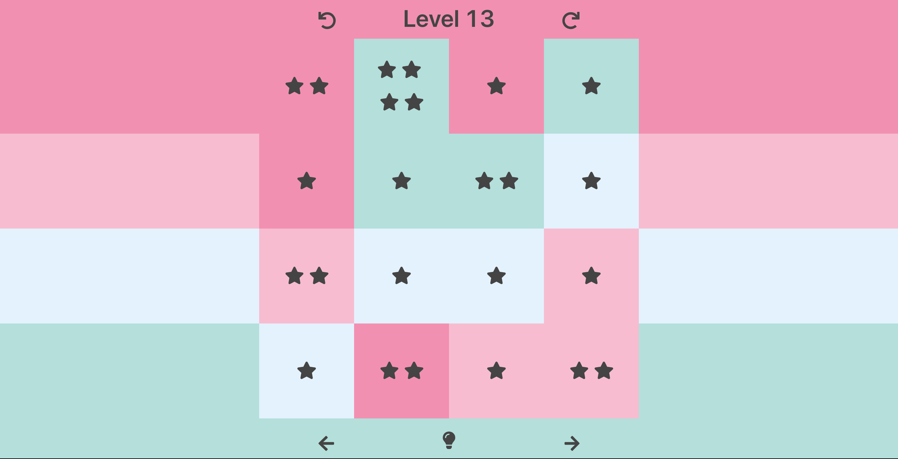
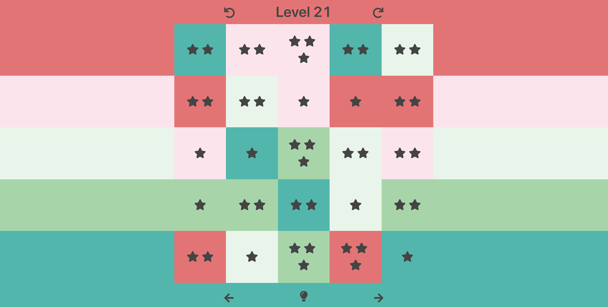

# Harmony Game
Harmony Game([Click here to play](https://master.dg9tray1uvpm6.amplifyapp.com/)  ) is a web game simulating the iOS puzzle
game ["har.mo.ny 3"](https://apps.apple.com/us/app/har-mo-ny-3/id982805507).    

Technical stack:  
Frontend: React + Webpack + Ant.d, deployed on AWS amplify  
Backend([repo here](https://github.com/mchozhang/harmony-server)): Serverless(AWS lambda) + GraphQL + DynamoDB + Golang  
Solution-Backend([repo here](https://github.com/mchozhang/harmony-solution)): tensorflow + reinforcement learning + flask
## Features
* A simulation of the original game with high-fidelity.
* Using GraphQL queries to request game data and mutations to create new game.
* Using Ant.design as the UI library.
* Deep learning model to solve the game for every level using `tensorflow-agents`.
* Using heuristic search algorithm(greedy search) to solve the top 20 levels(Good way to "cheat"!).
* Using Cookie to keep conquered games data.
* Deployed to AWS amplify 
* A good example of web-app implementation with React frontend and serverless GraphQL backend.
* A good example of usage of React hooks(useContext, useState, useRef, etc.)

## Screenshots




## Developer Run
Install dependencies
```
npm i
```

Run the app in development mode(localhost:3000).
```
npm start
```

Or run in docker
```
docker build -t harmony-game . && docker run -p 3000:3000 harmony-game
```
